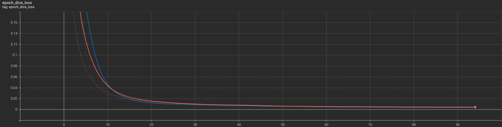
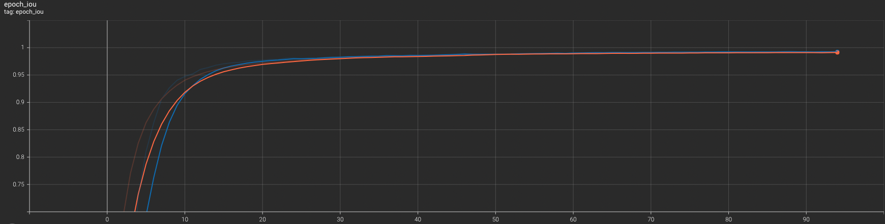
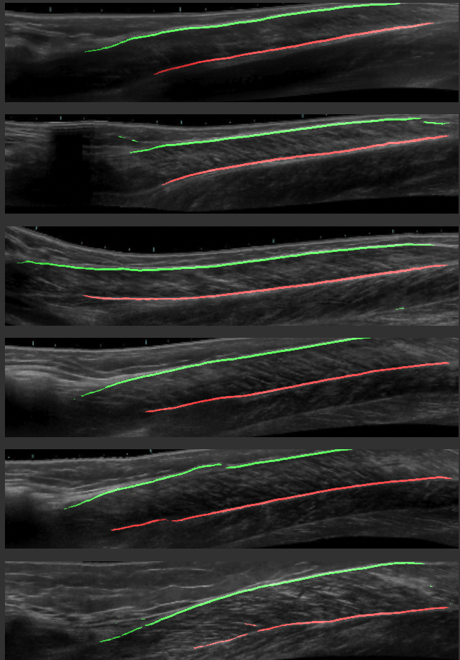

# TUM x DLR line detection for the aponeurosis

# Reproduce Training
It is possible to retrain the model with different images. It can either be done locally (fit.py), or at an online service (for example Google Colab - this needs a connected Google Drive account to access the training data and be able to save the created models and logfiles)

The project can be applied to other image segmentation tasks. For that, the steps are the following:
1. Create images as dataset (must be under "data/raw/images")
2. Create annotations
3. Apply convert_annot.py to get the single annotation files (.json)
4. Apply preprocess_dataset.py to transform the annotations and images (cutting, padding, splitting into training, test and validation data). Desired image format and shape can be specified in config.py

# Notebook
## CACoM_multi.ipynb

Contains the steps and code for the training on Google Colab. Further comments can be found in the notebook.

# Project Structure
## config.py

Contains the configuration used for training, model building and inference

The most important variables are:

* `imshape`: shape of the image
* `model_name`: name of the model architecture
* `BACKBONE`: backbone used for the previously defined model
* `BATCH_SIZE`: batch size used for training
* `LEARNING_RATE`: learning rate used by the optimizer Adam
* `LOSS`: loss function during training
* `ACTIVATION`: activation function of the output layer of the models
* `n_classes`: number of classes defined (upper, lower, background)
* `EPOCHS`: number of epochs for the training

## convert_annot.py

Convert the results.json file into separate .json files that can be effectively used for the training.
These are saved in folder_name, and image_folder is used for comparison (only creates .json if the corresponding image exists)

## data_generator.py

Creates a DataGenerator object suited for tensorflow. It feeds the data to the training, generating it each epoch. It makes the data customizable (such as augmentation), and uses way less memory (loading in just parts, not the whole of the dataset)

**Functions:**
- `__data_generation`:
  - generates a batch of images and the corresponding masks
  - also uses augmentation if specified (during training only at the training, not the validation data)
- `__getitem__`:
  - feeds the paths (number of paths is batchsize) to the __data_generation function
  - returns the batch of images and annotations
- `create_multi`:
  - creates one-hot encoded masks from the annotation files
- `augment_poly`:
  - augments the images and the corresponding masks
  - augmentation settings are defined at the beginning of the file

## fit.py

Defines the necessary variables for the training

Most important points:

- `train_imgs`, `train_annots`, `val_imgs`, `val_annots`: path of the files in list format
- `tg`: training data generator object; augmentation is True
- `vg`: validation data generator object; augmentation is False
- `model`: model returned from load_from_models
- `model`.compile: sets the training options for the model
  - `optimizer`: Adam
  - `loss`: loss specified in config
  - `metrics`: dice, iou
- `training_dir`: creates a directory for the training. The following data will be saved during training:
  - config.json: contains the configuration
  - logs: logs of the tensorboard callback
  - model.h5: the saved model weights (only the best, based on validation loss)
  - predictions: prediction images during training, created by TensorBoardMask
- `callbacks`:
  - `tensorboard_callback`: saves the development of the model during training (loss, iou, dice)
  - `checkpoint`: saves the best model
  - `checkpoint_abort`: aborts training if val_loss doesn't improve over the defined number of epochs
  - `LR_scheduler`: reduces the learning rate if val_loss doesn't improve over the defined number of epochs
- `model`.fit: trains the model with the defined attributes
  - `x`: input data
  - `validation_data`: validation data
  - `steps_per_epoch`: how many times the generator will be called per each epoch
  - `epochs`: number of epochs
  - `verbose`: sets verbosity (=1: shows the whole process of training)
  - `callbacks`: the callbacks that run at the end of each epoch

## helper_curvefitting.py

Fits a polynomial of a defined degree the predictions (upper and lower aponeurosis)

## model.py

Creates an untrained instance of the UNet model

## predict.py

Creates an inference from an input image
**Input**:
- `im`: image on which prediction is performed
- `model_path`: path to the model in .h5 format

**Output**:
- `info`: dictionary that contains the points of the fitted curve
- `drawing`: image with the predicted lines drawn on top (size: (640, 640, 3))

## preprocess_dataset.py

Preprocesses raw images and saves them. Data structure of the preprocessed images:

- data
  - test_set
    - annotations
    - images
  - train_set
    - annotations
    - images
  - validation_set
    - annotations
    - images

The output dimension of the images can be defined in the config.py file.

**Functions:**
- `pad_resize`:
  - adds zero padding and resizes the training and validation images and annotations
- `save_img_annot`:
  - saves the created image and annotations files
- `split_data`:
  - creates the validation set from the formatted data (default validation size: 20%)
- `preprocess_dataset`:
  - iterates through each image and the corresponding annotation, calling pad_resize and save_img_annot

## preprocessor_test.py

Tests whether the the funciton preprocess_dataset.py functioned properly (for visual inspection)

## util.py

Contains general utility functions

**Functions:**
- `preprocess_single`:
    - converts raw image to fit the model input dimensions (cutting + padding)
- `draw_prediction`:
    - draws prediction on top of the input image
- `sorted_files`:
  - Sorts the files in a given directory
- `return_paths`:
  - returns the paths in form of a list of the training and validation data (images as well as annotations)
- `create_config_json`:
  - creates the config.json file at the beginning of training

## data
Contains the data for the training

# Results:
## Training metrics:

Categorical Crossentropy

Dice Loss

IoU

## Prediction examples

Predictions on the first 6 images of the test set

